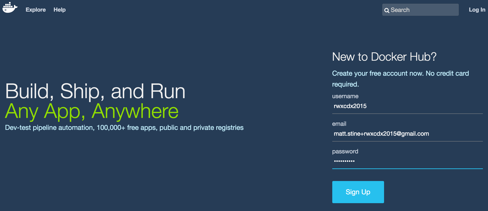
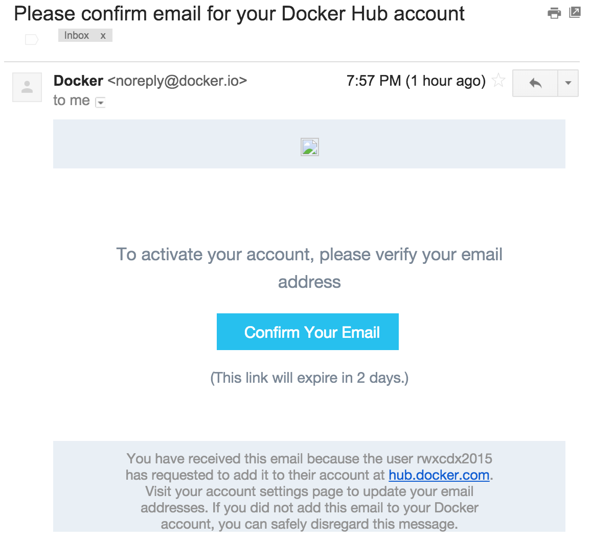

:compat-mode:
= Set Up Your Environment!

== Sign Up for a Docker Hub Account

If you haven't already, create an account on Docker Hub that you can use when we push images.

. In a browser, navigate to https://hub.docker.com/account/signup.

. Fill out the form and click *Sign up*:
+

. Activate your account by clicking *Confirm Your Email* in the email you receive from Docker Hub:
+

== Set Up Prerequisites

. Install *Docker* for your particular operating system by following the appropriate instructions:
* http://docs.docker.com/mac/step_one/[Mac OS X]
* http://docs.docker.com/windows/step_one/[Windows]
* http://docs.docker.com/linux/step_one/[Linux]
+
You only need to complete the instructions on the page titled _Install Docker for..._ For Mac OS X and Windows users, these instructions will take you through the installation of the Docker Toolbox, which provides everything you need to run Docker containers in a Boot2Docker Linux VM. For Linux users, you can run Docker containers natively, so these instructions will simply take you through the installation of the Docker daemon and CLI tool.
+
If you want to use your own terminal configuration (i.e. not the one provided by Docker Toolbox), you need to set three environment variables in your shell. You can view them using the `docker-machine` tool:
+
[source,shell]
----
$ docker-machine env default
export DOCKER_TLS_VERIFY="1"
export DOCKER_HOST="tcp://192.168.99.100:2376"
export DOCKER_CERT_PATH="/Users/pivotal/.docker/machine/machines/default"
export DOCKER_MACHINE_NAME="default"
# Run this command to configure your shell:
# eval "$(docker-machine env default)"
----
+
At this point, Mac OS X and Windows users are done with the Docker setup. You can proceed to <<step-3,Step 3>>.

. Install *Docker Compose* for Linux by running the following commands from the terminal:
+
[source,shell]
----
$ curl -L https://github.com/docker/compose/releases/download/1.5.1/docker-compose-`uname -s`-`uname -m` > /usr/local/bin/docker-compose

$ chmod +x /usr/local/bin/docker-compose
----
+
NOTE: If you get a ``Permission denied'' error, your `/usr/local/bin directory` probably isn’t writable and you’ll need to install Compose as the superuser. Run `sudo -i`, then the two commands above, then `exit`.

. [[step-3]]Install *Lattice* by following the instructions found http://lattice.cf/docs/getting-started/[here]. You will need to complete the following sections of the _Getting Started_ page:
* Pre-Requisites for the Vagrant VM (Mac OS X and Windows users: if you installed Docker first, you will not need to install Virtualbox, as Docker Toolbox took care of that.)
* Starting the Lattice Vagrant VM
* ltc - the Lattice CLI

== Warm Your Docker Cache

Using a Docker-enabled terminal (either by double-clicking on the Docker Quickstart Terminal icon or your own terminal setup as described above), execute the following command:

[source,shell]
----
$ docker run --rm -p 8080:8080 mstine/hello-docker-world
----

This will pull down the OpenJDK 8 Docker image layers we'll be using in the workshop, as well as the image layers for a sample application. It will then start the sample application and expose it on port 8080 on your boot2docker VM.

Once the application starts, you should see the following log message repeat every second:

[source,shell]
----
2015-07-19 18:09:50.718  INFO 1 --- [pool-1-thread-1] ication$$EnhancerBySpringCGLIB$$9613ffef : Hello from HelloDockerWorldApplication!
----

To access the application, identify the port for your Boot2Docker VM (if you are a Linux user, this is `localhost`!):

[source,shell]
----
$ docker-machine ls
NAME      ACTIVE   DRIVER       STATE     URL                         SWARM
default   -        virtualbox   Running   tcp://192.168.99.100:2376
----

And then access the application using that IP in the browser. For the IP above, you would access http://192.168.99.100:8080.

== More Cache Warming

Run each of the following commands from a Docker-enabled terminal:

[source,shell]
----
$ docker run debian echo hello world
$ docker run busybox echo hello world
$ docker run mysql echo hello world
$ docker run redis echo hello world
----

This will load the remainder of the base images we'll need throughout the workshop.
